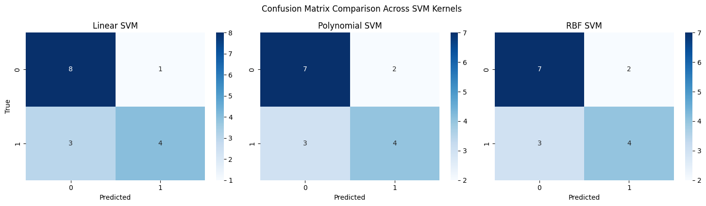
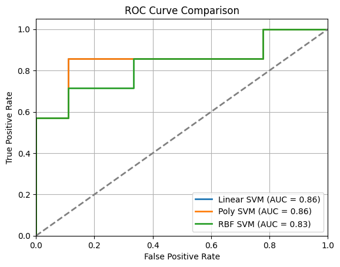
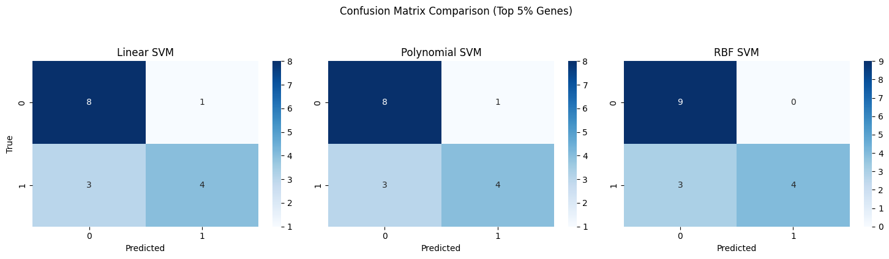

# Leukemia Patient classifier
## Introduction 
This project focuses on classifying leukemia patients into two subgroups based on gene expression data: those with a chromosomal translocation (1) and those cytogenetically normal (-1). The dataset includes 79 patients and expression levels for 2,000 genes.  
  
We apply supervised learning using Support Vector Machines (SVMs) to predict patient subgroups. Multiple kernel types (linear, polynomial, RBF) are tested with hyperparameter tuning via cross-validation. Additionally, we explore filtering the top 5% most variable genes to reduce noise and improve model performance.

We begin by splitting the data into training and test sets using scikit-learn, allocating 20% of the data for testing. As an additional but fundamental steps, we drop the column that are not useful. 


```python
X = data.drop(columns=["y", "sampleID"]) # Remove sample id
y = data["y"]  
 
from sklearn.model_selection import train_test_split  
X_train, X_test, y_train, y_test = train_test_split(X, y, test_size=0.2, random_state=0, stratify=y)
```

We examine the distribution of the target variable `y` to verify whether the dataset is balanced across the two classes. As shown in the histogram below, the number of samples in each class is similar, with a slight predominance of the -1 class.


This balance suggests that we can safely use standard performance metrics such as accuracy, ROC AUC, precision, and recall without applying class weighting or resampling techniques.

We will train three types of Support Vector Classifiers, each using a different kernel function (linear, polynomial, and RBF). In the final part of the analysis, we will repeat the same procedure on a corrected version of the dataset, applying a common preprocessing technique used in genetic studies.

The packages used to compute the analysis are implemented as

```python
import numpy as np  
from matplotlib import pyplot as plt  # import subplots, cm  
import sklearn.model_selection as skm  
import pandas as pd  
import seaborn as sns
```

## Dataset 
In this section we will use the dataset without any type of correction

### Model
In this section we will create and evaluate different model with different kernel:
- [[#Linear kernel]]
- [[#Polynomial kernel]]
- [[#Gaussian RBF Kernel]]
Each model is then trained and fine-tuned on the training set using cross-validation to ensure robust performance estimation, then is evaluated on a test set of unseen data

```python
kfold = skm.KFold(10, random_state=0, shuffle=True)
```


### Linear kernel 
We first apply a Support Vector Machine with a linear kernel, which is often a suitable baseline for high-dimensional datasets like gene expression data. The regularization parameter C is optimized using cross-validation to balance model complexity and generalization performance.

``` python 
from sklearn.pipeline import Pipeline  
from sklearn.preprocessing import StandardScaler  
linear_svm_clf = Pipeline([  
    ("scaler", StandardScaler()),  
    ("svm", SVC(kernel="linear", probability=True, random_state=0)),  
])  
  
## hyperparameter tuning  
from sklearn.model_selection import GridSearchCV  
parameters = {"svm__C":[0.001, 0.01, 0.1, 1, 10, 100, 1000]}  
  
grid_search_linear = GridSearchCV(  
    estimator = linear_svm_clf,  
    param_grid = parameters,  
    scoring = "accuracy",  
    n_jobs = -1,  
    refit = "accuracy",  
    cv= kfold)  
grid_search_linear.fit(X_train, y_train)
svm_linear_model = grid_search_linear.best_estimator_.named_steps["svm"]
```

**Model description**
The table below summarizes the main characteristics of the best-performing linear SVM model (`svm_linear_model`):

| Metric                    | Value               |
| ------------------------- | ------------------- |
| Total support vectors     | 57                  |
| Support vectors per class | `[30, 27]`          |
| Best CV score (accuracy)  | 0.81                |
| Best hyperparameters      | `{'svm__C': 0.001}` |

### Polynomial Kernel
We then extend the linear model by applying a polynomial kernel, which allows the SVM to capture non-linear relationships between gene expression features. Both the regularization parameter C and the polynomial degree are tuned via cross-validation.

```python
polynoaml_svm_clf = Pipeline([
    ("scaler", StandardScaler()),
    ("svm", SVC(kernel="poly", probability=True, random_state=0)),
])

## hyperparameter tuning
from sklearn.model_selection import GridSearchCV
parameters = {"svm__C":[0.001, 0.01, 0.1, 1, 10, 100, 1000],
              "svm__degree":[1,2,3,4,5,6]}

grid_search_poly = GridSearchCV(
    estimator = polynoaml_svm_clf,
    param_grid= parameters,
    scoring="accuracy",
    n_jobs=-1,
    refit="accuracy",
    cv= kfold,
)
grid_search_poly.fit(X_train, y_train)
svm_polynomial_model = grid_search_poly.best_estimator_.named_steps["svm"]

```

**Model Description**
The following table summarizes the characteristics of the best-performing polynomial SVM model:

| Metric                    | Value                              |
| ------------------------- | ---------------------------------- |
| Total support vectors     | 55                                 |
| Support vectors per class | `[29, 26]`                         |
| Best CV score (accuracy)  | 0.743                              |
| Best hyperparameters      | `{'svm__C': 10, 'svm__degree': 1}` |

### Gaussian RBF kernel
Finally, we apply a Gaussian (RBF) kernel SVM, which is well suited for capturing complex and non-linear patterns in the data. We tune both the regularization parameter C and the kernel coefficient gamma using cross-validation.

```python
gaussian_svm_clf = Pipeline([  
    ("scaler", StandardScaler()),  
    ("svm", SVC(kernel="rbf", probability=True, random_state=0)),  
])  
  
## hyperparameter tuning  
from sklearn.model_selection import GridSearchCV  
parameters = {"svm__C":[0.001, 0.01, 0.1, 1, 10, 100, 1000],  
              "svm__gamma": [0.0001, 0.001, 0.01, 0.1, 1, 10]}  
  
grid_search_gaussian = GridSearchCV(  
    estimator = gaussian_svm_clf,  
    param_grid= parameters,  
    scoring="accuracy",  
    n_jobs=-1,  
    refit="accuracy",  
    cv=kfold,  
)  
grid_search_gaussian.fit(X_train, y_train)  
svm_gaussian_model = grid_search_gaussian.best_estimator_.named_steps["svm"]
```

**Model Description**
The following table summarizes the characteristics of the best-performing RBF SVM model:

| Metric                    | Value                                  |
| ------------------------- | -------------------------------------- |
| Total support vectors     | 62                                     |
| Support vectors per class | `[32, 30]`                             |
| Best CV score (accuracy)  | 0.757                                  |
| Best hyperparameters      | `{'svm__C': 10, 'svm__gamma': 0.0001}` |


## Model Evaluation
The three SVM models, based on linear, polynomial, and RBF (Gaussian) kernels, demonstrate similar but not identical performance when evaluated on the test set.
The **Linear SVM** achieves the highest test accuracy (0.75) and F1-score (0.667), indicating that it performs better overall in balancing precision and recall. It also slightly outperforms the others in terms of ROC AUC (0.81), suggesting better ranking ability of positive versus negative examples. This performance, combined with the model’s simplicity, makes it a strong candidate in this setting. Both the **Polynomial SVM** and the **RBF SVM** yield lower accuracy (0.688) and identical recall (0.571), but slightly lower precision and F1-score compared to the linear model. Interestingly, the Polynomial SVM achieves the same AUC as the linear model (0.81), while the RBF SVM shows a slight drop (0.76). This suggests that although these models capture non-linearity, the overall best seem to be the linear

| Model      | Accuracy | ROC AUC | Precision | Recall | F1-score |
| ---------- | -------- | ------- | --------- | ------ | -------- |
| Linear SVM | 0.750    | 0.810   | 0.800     | 0.571  | 0.667    |
| Poly SVM   | 0.688    | 0.810   | 0.667     | 0.571  | 0.615    |
| RBF SVM    | 0.688    | 0.762   | 0.667     | 0.571  | 0.615    |


From the confusion matrices, we observe that all models tend to misclassify positive examples more often (this explain the lower recall)


From the ROC curve, we observe a characteristic "staircase" shape, which is due to the limited number of observations in the dataset. This low resolution in the curve reflects the small sample size and is consistent with the performance metrics reported in the summary table.


## Dataset variation
In high-dimensional gene expression datasets, it is common to perform feature selection prior to classification, in order to reduce noise and improve model interpretability. A widely adopted strategy is to retain only the most variable genes across samples, under the assumption that genes with low variance are less informative for distinguishing between conditions or subgroups. In this section, we apply this approach by selecting the top 5% most variable genes based on standard deviation. 

```python
# Compute standard deviation of genes on X_train  
stds = X_train.std(axis=0)  
# Select top 5% most variable genes  
top_genes = stds.sort_values(ascending=False).head(int(0.05 * len(stds))).index  
print(len(top_genes))
  
# Filter both train and test on these genes  
X_train_filtered = X_train[top_genes]  
X_test_filtered = X_test[top_genes]
```

Given the original dataset contains 2,000 genes, this results in a reduced feature set of 100 genes (fetched with `len(top_genes)`). We then repeat the same classification analysis using Support Vector Classifiers with linear, polynomial, and RBF kernels, and compare the results to declare the best model.
### Model
With the cleaned dataset, we repeat the same analysis by fitting the following three models:
- [[#Linear kernel]]
- [[#Polynomial kernel]]
- [[#Gaussian RBF Kernel]]

#### Linear kernel

```python
linear_svm_clf = Pipeline([  
    ("scaler", StandardScaler()),  
    ("svm", SVC(kernel="linear", probability=True, random_state=0)),  
])  
  
## hyperparameter tuning  
from sklearn.model_selection import GridSearchCV  
parameters = {"svm__C":[0.001, 0.01, 0.1, 1, 10, 100, 1000]}  
  
grid_search_linear_c = GridSearchCV(  
    estimator = linear_svm_clf,  
    param_grid = parameters,  
    scoring= "accuracy",  
    n_jobs=-1,  
    refit="accuracy",  
    cv= kfold,  
)  
grid_search_linear_c.fit(X_train_filtered, y_train)  
svm_linear_model_c = grid_search_linear_c.best_estimator_.named_steps["svm"]
```


**Model Description**
The table below summarizes the characteristics of the best-performing linear SVM model:

| Metric                    | Value             |
| ------------------------- | ----------------- |
| Total support vectors     | 35                |
| Support vectors per class | [16, 19]          |
| Best CV score (accuracy)  | 0.826             |
| Best hyperparameters      | `{'svm__C': 0.1}` |

#### Polynomial kernel 

```python
polynoaml_svm_clf = Pipeline([  
    ("scaler", StandardScaler()),  
    ("svm", SVC(kernel="poly", probability=True, random_state=0)),  
])  
  
## hyperparameter tuning  
from sklearn.model_selection import GridSearchCV  
  
parameters = {"svm__C": [0.001, 0.01, 0.1, 1, 10, 100, 1000],  
              "svm__degree": [1, 2, 3, 4, 5, 6]}  
  
grid_search_poly_c = GridSearchCV(  
    estimator=polynoaml_svm_clf,  
    param_grid=parameters,  
    scoring="accuracy",  
    n_jobs=-1,  
    refit="accuracy",  
    cv=kfold,  
)  
grid_search_poly_c.fit(X_train_filtered, y_train)  
svm_poly_model_c = grid_search_poly_c.best_estimator_.named_steps["svm"]
```


**Model Description**
The table below summarizes the characteristics of the best-performing polynomial SVM:

| Metric                    | Value                              |
| ------------------------- | ---------------------------------- |
| Total support vectors     | 35                                 |
| Support vectors per class | `[16, 19]`                         |
| Best CV score (accuracy)  | 0.826                              |
| Best hyperparameters      | `{'svm__C': 10, 'svm__degree': 1}` |


#### Gaussian RBF Kernel

```python
gaussian_svm_clf = Pipeline([  
    ("scaler", StandardScaler()),  
    ("svm", SVC(kernel="rbf", probability=True, random_state=0)),  
])  
  
## hyperparameter tuning  
from sklearn.model_selection import GridSearchCV  
  
parameters = {"svm__C": [0.001, 0.01, 0.1, 1, 10, 100, 1000],  
              "svm__gamma": [0.0001, 0.001, 0.01, 0.1, 1, 10]}  
  
grid_search_gaussian_c = GridSearchCV(  
    estimator=gaussian_svm_clf,  
    param_grid=parameters,  
    scoring="accuracy",  
    n_jobs=-1,  
    refit="accuracy",  
    cv=kfold,  
)  
grid_search_gaussian_c.fit(X_train_filtered, y_train)  
svm_gaussian_model_c = grid_search_gaussian_c.best_estimator_.named_steps["svm"]
```

**Model Description**
The following table summarizes the characteristics of the best-performing RBF (Gaussian):

| Metric                    | Value                                 |
| ------------------------- | ------------------------------------- |
| Total support vectors     | 42                                    |
| Support vectors per class | [22, 20]                              |
| Best CV score (accuracy)  | 0.871                                 |
| Best hyperparameters      | `{'svm__C': 10, 'svm__gamma': 0.001}` |

### Model Evaluation
In this analysis, we evaluated the performance of three support vector machine classifiers (Linear, Polynomial, and RBF) trained on the top 5% most variable genes, a standard feature selection technique in high-dimensional biological data.

It is interesting to note that the Linear SVM and the Polynomial SVM yield identical results. This can be explained by the model description tables, where we see that the polynomial model was trained with a degree of 1. Since a polynomial kernel with degree 1 is mathematically equivalent to a linear kernel, the two models effectively learn the same decision boundary. This also explains the overlapping ROC curves observed in the ROC curve comparison plot.

In terms of accuracy, the RBF SVM performed best (0.813), followed by the Linear and Polynomial models (0.750 each). The RBF model also achieved the highest F1-score (0.727), suggesting a more balanced trade-off between precision and recall. However, it’s worth noting that recall remained constant (0.571) across all models, meaning that none of the classifiers were able to capture a higher proportion of the true positive class.

| Model      | Accuracy | ROC AUC | Precision | Recall | F1-score |
| ---------- | -------- | ------- | --------- | ------ | -------- |
| Linear SVM | 0.750    | 0.857   | 0.800     | 0.571  | 0.667    |
| Poly SVM   | 0.750    | 0.857   | 0.800     | 0.571  | 0.667    |
| RBF SVM    | 0.813    | 0.825   | 1.000     | 0.571  | 0.727    |

Even if the two poly SVM and Linear SVM are overlapped, is interesting to see that the ranking performance of both are better that the RBF on SVM


Looking at the confusion matrices, we observe that:
- The Linear and Polynomial SVMs misclassified one instance of class 1 and three instances of class -1.
- The RBF SVM, while achieving perfect precision (1.0), still misclassified three negative instances, similar to the other models.



Overall, while the Linear SVM remains a strong and interpretable baseline, the RBF SVM showed a slight edge in terms of classification performance on this reduced feature set. Still, all models suffer from limited recall, likely due to the small dataset size. Future improvements could include incorporating more data, exploring ensemble methods, or adjusting the decision threshold to better balance precision and recall.

## Conclusion 
In this conclusion, we summarize the best-performing model for each kernel type, explain why the Linear and Polynomial SVMs (with degree 1) produce different results in the first analysis, and discuss which version of the dataset full or filtered yields better overall performance.

Across both experimental settings, we evaluated the performance of Support Vector Classifiers with linear, polynomial, and RBF kernels. In the original (unfiltered) dataset, the Linear SVM achieved the best overall balance between accuracy, F1-score, and ROC AUC, making it the most effective and interpretable model. In contrast, in the filtered dataset (top 5% most variable genes), the RBF SVM outperformed the others in terms of classification accuracy and F1-score, suggesting that it benefits from reduced dimensionality and noise

In the first analysis, the Linear and Polynomial SVMs yielded different results, despite the polynomial model selecting a degree of 1. This discrepancy is due to the different regularization parameters (`C`) selected by cross-validation:
- Linear SVM selected `C = 0.001` (strong regularization),
- Polynomial SVM selected `C = 10` (weaker regularization).
Even though a degree-1 polynomial kernel is mathematically equivalent to a linear kernel, the different `C` values led to distinct decision boundaries, explaining the performance gap.  
In the second analysis, both models selected `C = 0.1` and `degree = 1`, resulting in identical behavior and performance, including overlapping ROC curves. This confirms that, when hyperparameters align, the models are functionally equivalent. So even if these seems to be derived from the difference in algorithm of the package scikit-learn used for the analysis

The analysis using the filtered dataset (top 5% most variable genes) appears to be more effective overall. Despite reducing the feature space from 2,000 to 100 genes, performance either remained stable or improved, especially for the RBF SVM. This confirms that:
- Filtering out low-variance genes helps reduce noise,
- Simpler models are preferead because it generalize better,
- Feature selection is a valuable preprocessing step in high-dimensional biological data.
Therefore, the second analysis is preferable*, as it leads to more efficient models without sacrificing predictive performance — and in some cases, even enhancing it.